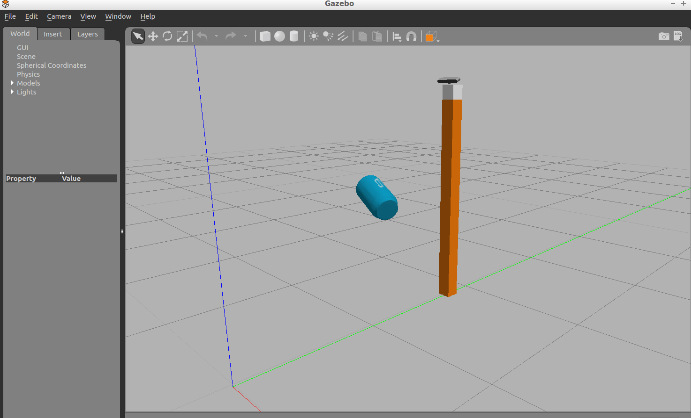

## Project: Perception Pick & Place by Ian Logan


### Summary

The goal of this project is to convert a PR2 camera image into point cloud data in order to segment out various items. The PR2 robot then uses machine learning in order to label and identify the individual items.

### Exercise 1, 2 and 3 pipeline implemented

#### 1. Complete Exercise 1 steps. Pipeline for filtering and RANSAC plane fitting implemented.

The following code can be found in the ```pcl_callback()``` function of the perception_pipeline.py. I will be working my way down the function, step-by-step.

Before starting filtering, it was important to see the kind of data I was working with. The ```pcl_callback()``` function takes in a ROS msg and converts it to point cloud data, so I took advantage of this by visualizing the cloud as I worked my way down.


Looking at the the original point cloud using pcl viewer, there were a little under 640,000 points and quite a bit of noise. 

Using a statistical outlier filter, I was able to reduce the noise significantly by setting a small threshold factor of .01, and analyzing 2 neighbors for every individual point. 

```python
# Set the number of neighboring points to analyze for any given point
outlier_filter.set_mean_k(2)

# Set threshold scale factor
x = .01
```


From there, I down sampled the data to a leaf size of .003. 

```python
vox = cloud_filtered.make_voxel_grid_filter()

#    Choose a voxel (also known as leaf) size
LEAF_SIZE = .003

#    Set the voxel (or leaf) size
vox.set_leaf_size(LEAF_SIZE,LEAF_SIZE,LEAF_SIZE)
```
This is still pretty small, but later I would be using a predictive model to identify the objects, and this size allowed their point clouds to retain excellent resolution while cutting down the total number of points in the scene to a little above 290,000. This was the resultant point cloud:


Next, I needed to isolate the table and objects from the rest of the scene. A passthrough filter allows you to create a threshold along an axis, cropping out any data outside of it. 

```python
passthrough = cloud_filtered.make_passthrough_filter()

#    Assign z-axis and range to the passthrough filter object.
filter_axis = 'z'
passthrough.set_filter_field_name(filter_axis)
axis_min = .6
axis_max = 1.1
passthrough.set_filter_limits(axis_min, axis_max)
```
By creating 3 passthrough filters (one for each of the x, y, and z directions), I was able to wrap the essential point cloud data in a small box around the table, while excluding everything else.


From here, I needed to separate the table and objects into separate point clouds. This is where RANSAC plane filtering comes in handy. 

```python
seg = cloud_filtered.make_segmenter()

#    Set the model you wish to fit
seg.set_model_type(pcl.SACMODEL_PLANE)
seg.set_method_type(pcl.SAC_RANSAC)

#    Max distance for a point to be considered fitting the model
max_distance = .005
seg.set_distance_threshold(max_distance)

#    Call the segment function to obtain set of inlier indices and model coefficients
inliers, coefficients = seg.segment()
```
RANSAC is an algorithm that can be used to identify simple shapes, so by taking advantage of the fact that the table is a plane, I was able to identify all the points that made up the table as inliers.

    cloud_table = cloud_filtered.extract(inliers, negative=False)


This meant that the only group left was the outliers (aka objects!)

```cloud_objects = cloud_filtered.extract(inliers, negative=True)```


#### 2. Complete Exercise 2 steps: Pipeline including clustering for segmentation implemented.  

With the object point cloud separated out, I needed to have them each recognized as individual objects, as opposed to one giant point cloud of outliers.  

Using PCL's Euclidean clustering algorithm would prove to be the best way to handle this. The algorithm cannot recognize color values, so the first step was to filter the point cloud information, so that only spatial coordinates remained. Then I used a k-d tree in order to separate the objects into clusters.

```python
white_cloud = XYZRGB_to_XYZ(cloud_objects)
tree = white_cloud.make_kdtree()
ec = white_cloud.make_EuclideanClusterExtraction()

#   Set tolerances for distance threshold
#   as well as minimum and maximum cluster size (in points)
ec.set_ClusterTolerance(0.01) #0.01
ec.set_MinClusterSize(400)
ec.set_MaxClusterSize(7000)

#   Search the k-d tree for clusters
ec.set_SearchMethod(tree)

#   Extract indices for each of the discovered clusters
cluster_indices = ec.Extract()
```


With the clusters extracted, it was important to be able to visualize them in order to make sure that each object was clustered correctly. (Note: The following loop also contains the code for identifying and labeling the objects. For readability's sake, I've segmented out the relevant parts concerning color coding the clusters)

```python
# TODO: Create Cluster-Mask Point Cloud to visualize each cluster separately
cluster_color = get_color_list(len(cluster_indices))

color_cluster_point_list = []
```
```python
for j, indices in enumerate(cluster_indices):
```
```python
    for i, indice in enumerate(indices):
        color_cluster_point_list.append([white_cloud[indice][0],
                                        white_cloud[indice][1],
                                        white_cloud[indice][2],
                                        rgb_to_float(cluster_color[j])])
```


Using this color coding, I was able to ensure that the objects were correctly clustered. Now, I just needed to have them identified and labelled!


#### 3. Complete Exercise 3 Steps.  Features extracted and SVM trained.  Object recognition implemented.

There were several steps to take in order to identify the individual objects. The first was to compute histograms for each cluster to pull out the significant features that make each object unique. The code features.py contains the two most important functions for this, namely ```compute_color_histograms()```  and ```compute_normal_histograms()``` . 

Stepping through the point cloud data, ```compute_color_histograms()``` obtains the normalized HSV signature of a cluster by concatenating three histograms (hue, saturation, and value).  A bin size of 32 kept the number of unique elements per feature high, without sacrificing much computing power. The range accounts for all values found within the HSV color space:

```python
# TODO: Compute histograms
rh_hist = np.histogram(channel_1_vals, bins=32, range=(0,256))
gs_hist = np.histogram(channel_2_vals, bins=32, range=(0,256))
bv_hist = np.histogram(channel_3_vals, bins=32, range=(0,256))

# TODO: Concatenate and normalize the histograms
hist_features = np.concatenate((rh_hist[0], gs_hist[0], bv_hist[0])).astype(np.float64)

# normalize features
normed_features = hist_features / np.sum(hist_features)
return normed_features
```


With color accounted for, ```compute_normal_histograms()``` instead accounts for shape through creating a normalized histogram for the surface normals of an object. The function generally follows the same format as ```compute_color_histograms()```, with the exception that it builds histograms using the x, y, and z coordinates of vectors and only has a range from -1 to 1 (since they are unit vectors).

```python
# TODO: Compute histograms of normal values (just like with color)
# normal values only range from -1 to 1 inclusive
x_hist = np.histogram(norm_x_vals, bins=32, range=[-1,1])
y_hist = np.histogram(norm_y_vals, bins=32, range=[-1,1])
z_hist = np.histogram(norm_z_vals, bins=32, range=[-1,1])

# TODO: Concatenate and normalize the histograms
hist_features = np.concatenate((x_hist[0], y_hist[0], z_hist[0])).astype(np.float64)

# Generate random features for demo mode.
# Replace normed_features with your feature vector
normed_features = hist_features / np.sum(hist_features)

return normed_features
```


With the functions for accumulating data defined, the next step was to actually collect that data. Using capture_features.py, I iterated through a list of objects that would be found in the test worlds:

```python
n_models = [\
    'sticky_notes',
    'book',
    'snacks',
    'biscuits',
    'eraser',
    'soap2',
    'soap',
    'glue']
```


A camera captured the features of each object in Gazebo, and then stored the histogram data to list with an object label associated with it. This was done 300 times per object for a total of 2400 features:

```python
# Extract histogram features
chists = compute_color_histograms(sample_cloud, using_hsv=True)
normals = get_normals(sample_cloud)
nhists = compute_normal_histograms(normals)
feature = np.concatenate((chists, nhists))
labeled_features.append([feature, model_name])
```
(example of what the process looked like)




Finally, using train_svm.py, I trained two models using the data. The first one, a SVM (Support Vector Machine) using a linear kernel, scored very well:

```python
# Create classifier
clf = svm.LinearSVC()

#Set up 5-fold cross-validation
kf = cross_validation.KFold(len(X_train),
                            n_folds=5,
                            shuffle=True,
                            random_state=1)
```


The second was a tree using an extra tree classifier. It performed well, yet underperformed the SVM in it's training:

``````python
# Create classifier
clf = tree.ExtraTreeClassifier()

#Set up 5-fold cross-validation
kf = cross_validation.KFold(len(X_train),
                            n_folds=5,
                            shuffle=True,
                            random_state=1)
``````


With the models prepared, I went back to  ```pcl_callback()``` to use the models in the actual project (found within the same loop iterating through the clusters). The function would essentially perform the same task as before extracting features as seen in capture_features.py, though with the addition that it would also make a prediction in real time as to what it thought the cluster object in front of it represented:

```python
    #     Extract Histogram Features
    chists = compute_color_histograms(ros_cluster, using_hsv=True)
    normals = get_normals(ros_cluster)
    nhists = compute_normal_histograms(normals)
    feature = np.concatenate((chists, nhists))

    # Make the prediction
    prediction = clf.predict(scaler.transform(feature.reshape(1,-1)))
    label = encoder.inverse_transform(prediction)[0]
    detected_objects_labels.append(label)
    # Publish a label into RViz
    label_pos = list(white_cloud[indices[0]])
    label_pos[2] += .4
    object_markers_pub.publish(make_label(label,label_pos, j))

    # Add the detected object to the list of detected objects.
    do = DetectedObject()
    do.label = label
    do.cloud = ros_cluster
    detected_objects.append(do)
```


### Pick and Place Setup

#### 1. For all three tabletop setups (`test*.world`), perform object recognition, then read in respective pick list (`pick_list_*.yaml`). Next construct the messages that would comprise a valid `PickPlace` request output them to `.yaml` format.

With object recognition fully implemented, the pr2 was able to successfully identify all of the objects in each world!


However, one model did slightly outperform the other, despite having a lower training accuracy...

**SVM**


**Tree Classifier**


I decided to stick with the tree classifier, since it always classified the objects correctly.


To end the project, I used the `pr2_mover()` function to output YAML files containing location information on where the detected objects were vs. where they needed to be. The first step concerned figuring out where the object were.  To do this, I computed the centroids of the detected objects, so the arm would know where to position its grasper

```python
# Loop through identified objects to create lists of labels and centroids
label_indices = [] # will be used later for popping values out of list
labels = []
centroids = []
for object in identified_objects:
    labels.append(object.label)
    points_arr = ros_to_pcl(object.cloud).to_array()
    centroids.append(np.mean(points_arr, axis=0)[:3])
```


The second step was figuring out where to place the objects. The pick list YAML file for each world contains information on what box each object in should be deposited in, the pose of that box, and what arm should be used to put it there. By looping through that information, I was able to figure out where to put each object.


```python
# TODO: Rotate PR2 in place to capture side tables for the collision map

# TODO: Loop through the pick list
for i in range(0, len(object_list_param)):

    # TODO: Parse parameters into individual variables
    object_name.data = str(object_list_param[i]['name'])

    # TODO: Create 'place_pose' and 'arm_name' for the object
    if dropbox_param[0]['group'] == object_list_param[i]['group']: # checks if object belongs in red box
        place_pose.position.x = dropbox_param[0]['position'][0]
        place_pose.position.y = dropbox_param[0]['position'][1]
        place_pose.position.z = dropbox_param[0]['position'][2]
        arm_name.data = dropbox_param[0]['name']

    else:                                                      # otherwise it goes in green box
        place_pose.position.x = dropbox_param[1]['position'][0]
        place_pose.position.y = dropbox_param[1]['position'][1]
        place_pose.position.z = dropbox_param[1]['position'][2]
        arm_name.data = dropbox_param[1]['name']

    for j in range(0, len(labels)):
        if labels[j] == object_name.data:
            label_indices.append(j)
            # TODO: Get the PointCloud for a given object and obtain it's centroid
            pick_pose.position.x = np.asscalar(centroids[j][0])
            pick_pose.position.y = np.asscalar(centroids[j][1])
            pick_pose.position.z = np.asscalar(centroids[j][2])
```


Afterwards, I was able to store the needed information into a dictionary that would convert the information to a YAML file:


And finally the project was finished!

 If I were to make more adjustments, though, I would increase the leaf size for the voxel down sampling step to take up even less data for storing the point clouds. While the resolution is great for identifying objects, the code runs slower than I would like it to. It is also hard to say whether or not the clustering algorithm is optimized for objects of all shapes and sizes. While it did fine for these objects, it would fail if an object with too many (or too little) points in its point cloud were introduced to the scene.

With that said, I was really happy with how the tree classifier performed. I was surprised that it's accuracy in practice outperformed the SVM considering there was a pretty big difference in training accuracy. I would be curious to see how well it does if it were trained on more object models.

If I were to pursue this project further, the natural next step would be to have the pr2 robot actually complete the pick and place operations. I think it would be an interesting challenge to implement collision detection for the other objects. Overall this project was great for learning how to implement robot perception, and it was an excellent way to see object recognition in action!


